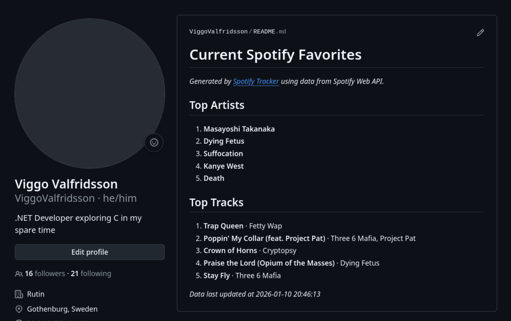

# Spotify Tracker

This is my first ever C project. This is a program that fetches your top artists and tracks on Spotify and writes them
to a GitHub repository file. The application outputs stats in markdown and is intended to write to your GitHub profile's
README.md file. If you then run the application on a schedule it will automatically update your listening stats as they
change.



## Dependencies

Make sure you have libcurl installed.

### Fedora/RHEL/CentOS

```sh
sudo dnf install libcurl-devel
```

### Ubuntu/Debian

```sh
sudo apt update
sudo apt install libcurl4-openssl-dev
```

### Arch Linux

```sh
sudo pacman -S curl
```

## Setup and Running

### 1. Set up Spotify API credentials

Follow the [official Spotify API documentation](https://developer.spotify.com/documentation/web-api/concepts/apps) to create an app, then add `https://httpbin.org/anything` as an allowed redirect URI.

### 2. Configure Spotify credentials

Create the credentials file:

```sh
mkdir -p ~/.config/spotify-tracker
touch ~/.config/spotify-tracker/spotify-credentials
```

Add your credentials in the following format:

```json
{
    "clientId": "<client-id>",
    "clientSecret": "<client-secret>"
}
```

### 3. Set up GitHub repository

Create a GitHub repository for your Spotify listening data. The program is intended to write to your profile's `README.md`, but any repository/file can be used.

### 4. Generate GitHub Personal Access Token

Generate a [fine-grained PAT](https://docs.github.com/en/authentication/keeping-your-account-and-data-secure/managing-your-personal-access-tokens#creating-a-fine-grained-personal-access-token) with **Contents** → **Read and write** permissions for your repository.

### 5. Configure GitHub settings

Create the configuration file:
```sh
touch ~/.config/spotify-tracker/github-config
```

Add your GitHub details:
```json
{
    "repoOwner": "<owner-name>",
    "repoName": "<repo-name>",
    "fileName": "<file-name>",
    "committer": "<committer>",
    "email": "<email>",
    "pat": "<pat>"
}
```

### 6. Build

```sh
make
```

### 7. Authenticate 

Run the following command and follow the instructions
```sh
./bin/spotify-tracker -l
```

### 8. Run

```sh
./bin/spotify-tracker
```
